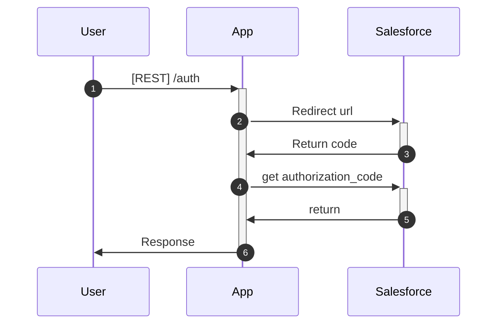

# Salesforce app example

This is example of salesforce connected app

## How to link app

- Register salesforce developer edition account ([link](https://developer.salesforce.com/signup))
- Create Connected App, see: [How to create connected app](docs/how-to-create-app.md)
- Open the CDC menu and add the standard object that you want to subscribe
- (TODO) add UI for register CDC standard object
