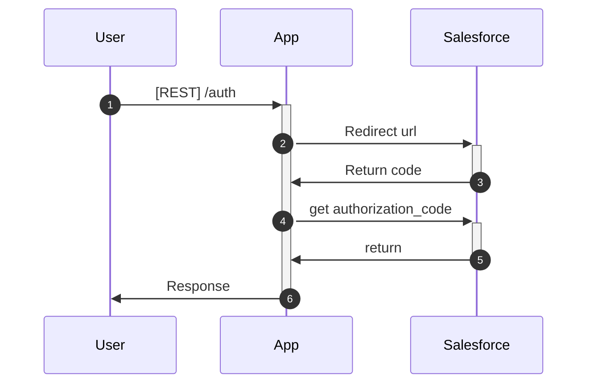

# Salesforce app example

This is example of salesforce connected app

```mermaid
sequenceDiagram
    autonumber

    participant user as User
    participant app as App
    participant sf as Salesforce

    user->>+app: [REST] /auth
    app->>+sf: Redirect url
    sf->>-app: Return code
    app->>+sf: get authorization_code
    sf->>-app: return
    app->>-user: Response
```
