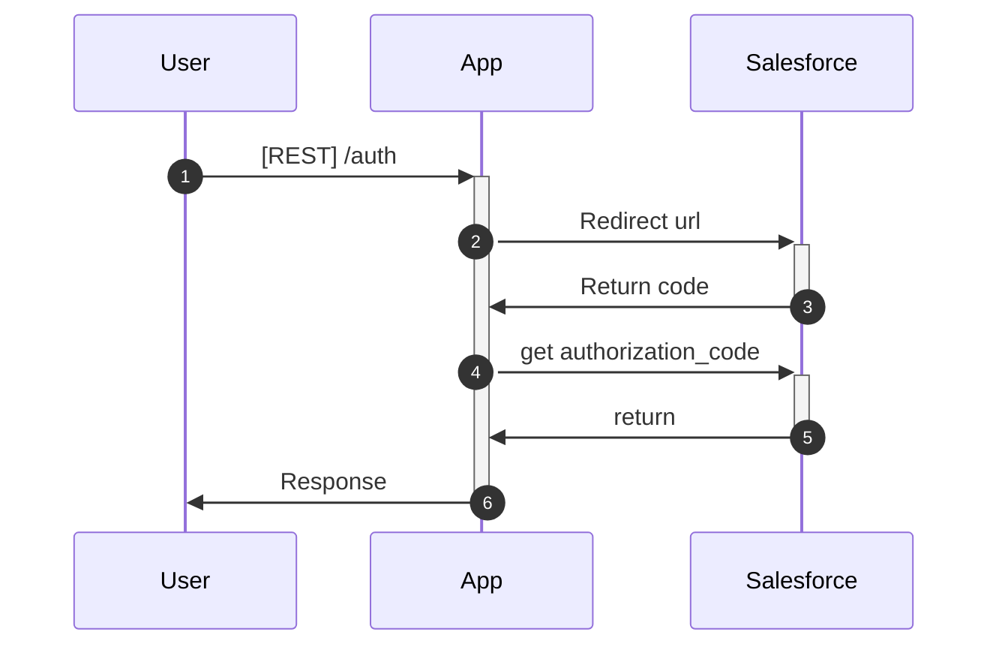

# Salesforce app example

This is example of salesforce connected app



```
https://connect-momentum-3503.my.salesforce.com/services/oauth2/authorize?
client_id=3MVG9fe4g9fhX0E6ZWCD0XNigpXEN5swRzlbInje3qHqoA4z0rVY0gsHEPQZl1bYTIblOmGF40OLWm5ylqvTl&
redirect_uri=https://webhook.site/0e9734d9-def1-4ac9-86cc-311f3be074ac&
response_type=code
```
